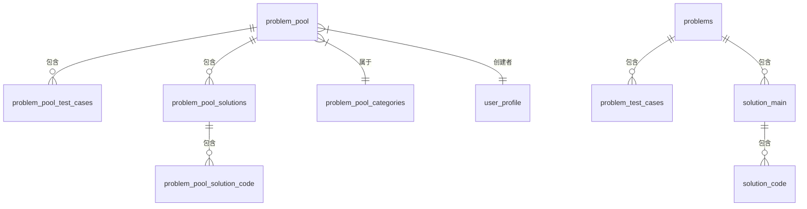

# 题目池功能 API 设计

## 1. 题目池统计信息 API

### 请求

```
GET /api/admin/problem-pool/statistics
```

### 响应

```json
{
  "success": true,
  "data": {
    "totalProblems": 100,
    "totalCategories": 10,
    "difficultyDistribution": {
      "简单": 30,
      "中等": 50,
      "困难": 20
    }
  }
}
```

## 2. 题目池列表 API

### 请求

```
GET /api/admin/problem-pool/list
```

### 查询参数

| 参数名 | 类型 | 必填 | 描述 |
|-------|------|------|------|
| page | Number | 否 | 当前页码，默认为1 |
| limit | Number | 否 | 每页显示数量，默认为10 |
| query | String | 否 | 搜索关键词，用于搜索题目标题或序号 |
| difficulty | String | 否 | 按难度筛选 (简单/中等/困难) |
| tags | String | 否 | 按标签筛选，多个标签用逗号分隔 |

### 响应

```json
{
  "success": true,
  "data": {
    "total": 100,
    "page": 1,
    "limit": 10,
    "problems": [
      {
        "id": 1,
        "problem_number": "P001",
        "title": "两数之和",
        "difficulty": "简单",
        "tags": "数组,哈希表",
        "category": 1,
        "category_name": "算法基础",
        "source": "LeetCode",
        "create_user_id": 1,
        "creator": {
          "display_name": "管理员",
          "avatar_url": "/images/avatar/default.png"
        },
        "reference_count": 5,
        "created_at": "2023-01-01T00:00:00Z"
      },
      // 更多题目...
    ]
  }
}
```

## 3. 题目池分类列表 API

### 请求

```
GET /api/admin/problem-pool/categories
```

### 响应

```json
{
  "success": true,
  "data": {
    "categories": [
      {
        "id": 1,
        "name": "算法基础",
        "description": "基础算法题目",
        "parent_id": null,
        "order_num": 1
      },
      // 更多分类...
    ]
  }
}
```

## 4. 获取题目详情 API

### 请求

```
GET /api/admin/problem-pool/:id
```

### 路径参数

| 参数名 | 类型 | 必填 | 描述 |
|-------|------|------|------|
| id | Number | 是 | 题目ID |

### 响应

```json
{
  "success": true,
  "data": {
    "problem": {
      "id": 1,
      "problem_number": "P001",
      "title": "两数之和",
      "difficulty": "简单",
      "tags": "数组,哈希表",
      "description": "给定一个整数数组 nums 和一个目标值 target，请你在该数组中找出和为目标值的那两个整数，并返回他们的数组下标。",
      "time_limit": 1000,
      "memory_limit": 256,
      "category": 1,
      "source": "LeetCode",
      "create_user_id": 1,
      "reference_count": 5
    },
    "test_cases": [
      {
        "id": 1,
        "input": "[2, 7, 11, 15]\n9",
        "output": "[0, 1]",
        "is_example": true,
        "order_num": 1
      },
      // 更多测试用例...
    ],
    "solutions": [
      {
        "id": 1,
        "solution_approach": "使用哈希表存储遍历过的元素及其索引...",
        "time_complexity": "O(n)",
        "space_complexity": "O(n)",
        "code": [
          {
            "language_id": 1,
            "language_name": "JavaScript",
            "standard_solution": "/**\n * @param {number[]} nums\n * @param {number} target\n * @return {number[]}\n */\nvar twoSum = function(nums, target) {\n    const map = new Map();\n    for (let i = 0; i < nums.length; i++) {\n        const complement = target - nums[i];\n        if (map.has(complement)) {\n            return [map.get(complement), i];\n        }\n        map.set(nums[i], i);\n    }\n    return [];\n};"
          },
          // 更多语言...
        ]
      }
    ]
  }
}
```

## 5. 引用题目到正式题库 API

### 请求

```
POST /api/admin/problem-pool/import/:id
```

### 路径参数

| 参数名 | 类型 | 必填 | 描述 |
|-------|------|------|------|
| id | Number | 是 | 题目池中的题目ID |

### 请求体

```json
{
  "problem": {
    "title": "两数之和（修改版）",
    "difficulty": "简单",
    "tags": "数组,哈希表,查找",
    "description": "给定一个整数数组 nums 和一个目标值 target，请你在该数组中找出和为目标值的那两个整数，并返回他们的数组下标。你可以假设每种输入只会对应一个答案。",
    "time_limit": 1000,
    "memory_limit": 256
  },
  "test_cases": [
    {
      "input": "[2, 7, 11, 15]\n9",
      "output": "[0, 1]",
      "is_example": true,
      "order_num": 1
    },
    // 可能更新的测试用例...
  ],
  "solutions": {
    "solution_approach": "使用哈希表存储遍历过的元素及其索引，实现O(n)时间复杂度的解法。",
    "time_complexity": "O(n)",
    "space_complexity": "O(n)",
    "code": [
      {
        "language_id": 1,
        "standard_solution": "/**\n * @param {number[]} nums\n * @param {number} target\n * @return {number[]}\n */\nvar twoSum = function(nums, target) {\n    const map = new Map();\n    for (let i = 0; i < nums.length; i++) {\n        const complement = target - nums[i];\n        if (map.has(complement)) {\n            return [map.get(complement), i];\n        }\n        map.set(nums[i], i);\n    }\n    return [];\n};"
      }
    ]
  }
}
```

### 响应

```json
{
  "success": true,
  "data": {
    "message": "题目成功引用到正式题库",
    "problem_id": 42,
    "problem_number": "P042"
  }
}
```

## 6. 从题目池删除题目 API

### 请求

```
DELETE /api/admin/problem-pool/:id
```

### 路径参数

| 参数名 | 类型 | 必填 | 描述 |
|-------|------|------|------|
| id | Number | 是 | 题目池中的题目ID |

### 响应

```json
{
  "success": true,
  "data": {
    "message": "题目已从题目池中删除"
  }
}
```

## 7. 获取题目标签列表 API

### 请求

```
GET /api/admin/problem-pool/tags
```

### 响应

```json
{
  "success": true,
  "data": {
    "tags": ["数组", "字符串", "链表", "哈希表", "数学", "排序", "二分查找", "动态规划", "广度优先搜索", "深度优先搜索"]
  }
}
```

## 8. 数据库表关系

题目池功能涉及以下数据库表关系：



## 9. API 错误处理

所有 API 在发生错误时，将返回以下格式的响应：

```json
{
  "success": false,
  "error": {
    "code": "ERROR_CODE",
    "message": "错误信息描述"
  }
}
```

### 常见错误码

| 错误码 | HTTP状态码 | 描述 |
|-------|-----------|------|
| PROBLEM_NOT_FOUND | 404 | 题目不存在 |
| VALIDATION_ERROR | 400 | 请求参数验证失败 |
| UNAUTHORIZED | 401 | 未授权访问 |
| FORBIDDEN | 403 | 无权限执行操作 |
| SERVER_ERROR | 500 | 服务器内部错误 | 