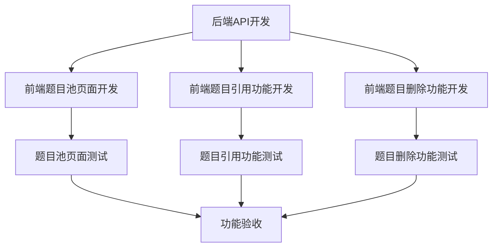

# 题目池功能 PRD 文档

## 1. 项目概述

### 1.1 背景

当前系统已有题目管理功能，支持题目的添加、编辑、删除等基本操作。为了提高题目管理的便捷性和复用性，需要开发"题目池"功能，允许管理员从题目池中快速引用题目到正式题库。

### 1.2 目标

开发一个题目池模块，允许管理员：
- 从题目池中查看和筛选题目
- 将题目池中的题目引用到正式题库
- 管理题目池中的题目

## 2. 数据库结构分析

### 2.1 现有相关表结构

基于查询发现，系统中与题目相关的主要表包括：

- **problem_pool**: 题目池表
  - id, problem_number, title, difficulty, tags, description, time_limit, memory_limit, category, source, create_user_id, reference_count, status, created_at, updated_at

- **problem_pool_categories**: 题目池分类表
  - id, name, description, parent_id, order_num, created_at, updated_at

- **problems**: 正式题库表
  - id, problem_number, title, difficulty, total_submissions, acceptance_rate, tags, description, time_limit, memory_limit, accepted_submissions

- **problem_test_cases**: 题目测试用例表
  - id, problem_id, input, output, is_example, order_num, created_at, updated_at

- **solution_main**: 题目解决方案主表
  - id, problem_id, solution_approach, time_complexity, space_complexity, created_at, updated_at

- **solution_code**: 题目解决方案代码表
  - id, solution_id, language_id, standard_solution, version, created_at, updated_at

## 3. 功能需求

### 3.1 题目管理页面添加"一键出题"按钮

[ ] 在当前题目管理页面的新建题目按钮左侧添加"一键出题"按钮

### 3.2 题目池首页（页面1）

[ ] 开发题目池首页，包含以下组件：

#### 3.2.1 统计卡片区域
[ ] 题目总数统计：显示 problem_pool 表中的记录总数
[ ] 分类总数统计：显示 problem_pool_categories 表中的记录总数
[ ] 难度分布统计：根据 problem_pool 表中的 difficulty 字段统计各难度题目数量并展示进度条

#### 3.2.2 搜索和筛选区域
[ ] 搜索框：支持通过题目标题(title)和序号(problem_number)进行查询
[ ] 筛选按钮：点击显示筛选区域
[ ] 筛选区域：
  - [ ] 难度等级筛选：根据 problem_pool 表的 difficulty 字段
  - [ ] 题目分类筛选：根据 problem_pool 表的 tags 字段

#### 3.2.3 数据表格区域
[ ] 表头：题目序号、题目标题、题目难度、标签、题目分类、题目来源、创建者头像和名称、被引用次数
[ ] 表格内容：展示题目池中的题目信息
[ ] 每行操作按钮：
  - [ ] 引用按钮：点击弹出窗口1
  - [ ] 删除按钮：点击弹出窗口2

#### 3.2.4 分页导航区域
[ ] 实现简洁的分页导航，每页显示10道题目

### 3.3 引用题目弹窗（窗口1）

[ ] 开发引用题目弹窗，包含以下功能：
  - [ ] 显示题目基本信息
  - [ ] 支持编辑题目信息
  - [ ] 发布功能：将题目发布到正式题库（problems、problem_test_cases、solution_main、solution_code）

### 3.4 删除确认弹窗（窗口2）

[ ] 开发删除确认弹窗：
  - [ ] 确认是否删除题目
  - [ ] 执行删除操作

## 4. 业务流程

### 4.1 进入题目池流程

```mermaid
graph TD;
    A[开始] --> B[点击题目管理页面的"一键出题"按钮];
    B --> C[进入题目池首页];
    C --> D[查看题目池统计信息和题目列表];
    D --> E[结束];
```

### 4.2 题目筛选流程

```mermaid
graph TD;
    A[开始] --> B[在题目池首页点击筛选按钮];
    B --> C[展开筛选区域];
    C --> D{选择筛选条件};
    D -->|选择难度等级| E[根据难度筛选题目];
    D -->|选择题目分类| F[根据分类标签筛选题目];
    D -->|输入搜索关键词| G[根据标题或序号搜索题目];
    E --> H[更新题目列表显示];
    F --> H;
    G --> H;
    H --> I[点击"取消筛选"按钮可清除所有筛选条件];
    I --> J[结束];
```

### 4.3 题目引用流程

```mermaid
graph TD;
    A[开始] --> B[在题目池列表中找到目标题目];
    B --> C[点击题目行的"引用"按钮];
    C --> D[弹出引用题目窗口];
    D --> E[查看并编辑题目信息];
    E --> F{点击"发布"按钮};
    F -->|确认| G[创建新题目到正式题库];
    F -->|取消| H[关闭弹窗];
    G --> I[更新problem_pool表中题目的reference_count];
    I --> J[关闭弹窗];
    J --> K[返回题目池列表];
    H --> K;
    K --> L[结束];
```

### 4.4 题目删除流程

```mermaid
graph TD;
    A[开始] --> B[在题目池列表中找到目标题目];
    B --> C[点击题目行的"删除"按钮];
    C --> D[弹出删除确认窗口];
    D --> E{确认删除?};
    E -->|是| F[从题目池中删除题目];
    E -->|否| G[关闭弹窗];
    F --> H[刷新题目池列表];
    G --> H;
    H --> I[结束];
```

## 5. 前端组件及路由

### 5.1 新增路由

[ ] 在前端路由配置中添加题目池相关路由：
```javascript
{
  path: '/admin/problem-pool',
  name: 'ProblemPool',
  component: () => import('@/views/admin/problem-pool.vue'),
  meta: { requiresAuth: true, requiresAdmin: true }
}
```

### 5.2 新增组件

[ ] 题目池首页组件 (problem-pool.vue)
[ ] 引用题目弹窗组件 (components/ProblemImportDialog.vue)
[ ] 删除确认弹窗组件 (components/DeleteConfirmDialog.vue)

## 6. 后端API设计

### 6.1 题目池相关API

[ ] 获取题目池统计信息
```
GET /api/admin/problem-pool/statistics
```

[ ] 获取题目池列表（带分页和筛选）
```
GET /api/admin/problem-pool/list
```

[ ] 获取题目池分类列表
```
GET /api/admin/problem-pool/categories
```

[ ] 引用题目到正式题库
```
POST /api/admin/problem-pool/import/:id
```

[ ] 从题目池删除题目
```
DELETE /api/admin/problem-pool/:id
```

## 7. 实施计划

### 7.1 后端开发任务

[ ] 开发题目池相关API
[ ] 实现题目引用逻辑（从题目池到正式题库的数据转移）
[ ] 实现题目池统计功能

### 7.2 前端开发任务

[ ] 在题目管理页面添加"一键出题"按钮
[ ] 开发题目池首页
[ ] 开发引用题目弹窗
[ ] 开发删除确认弹窗
[ ] 实现筛选和分页功能

### 7.3 测试任务

[ ] 测试题目池页面功能
[ ] 测试题目引用功能
[ ] 测试题目删除功能
[ ] 测试筛选和分页功能

## 8. 开发依赖关系

